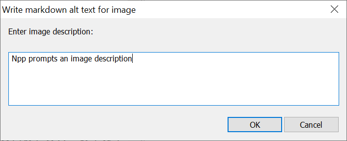
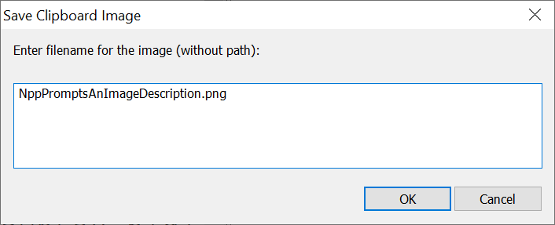
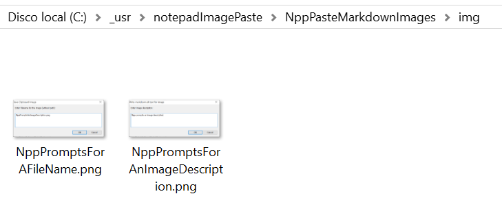

# Notepad++ paste Markdown images

"Paste" images when editing Markdown files in Notepad++

## What it does

1. You paste an image to Windows clipboard from a screen capture, from a browser image, whatever.
2. In Notepad++, while editing a Markdown document, you hit a keyboard shortcut, `Ctrl-Alt-Shift-V` in this document or the one you wish to configure.
3. Notepad++ will prompt you for an image description.



4. Notepad++ will prompt you for a file name. The default value is the no blanks camel case version of the description. Keep the `.png` extension.



5. The clipboard image will be saved in the `img` directory relative to the document, with the filename given and in PNG format.



6. Markdown code `` will be automatically inserted.

You are done "pasting" images into Markdown with Notepad++! :)

The images above and all images in this document and site were "pasted" as explained.

## How it works

- On Notepad ++, install **PythonScript** plugin.
- Add [PasteImageSave.py](PasteImageSave.py) as a **PythonScript** personal script.
- Associate `PasteImageSave.py` to a short cut of your choice.

See [installation details](installDetails.md)

## Bonus track: MkDocs with Material theme

See this [sample MkDocs project](smapleMkDocs) to get an archetype of a MkDocs site 
with several goodies such as copy code button, language based syntax higlighting, CSS override, corporate logo...

The site can be previewed from a Docker container with this command, no need to install anything:

```
rem Open a browser and point it to the site
rem Reload the page when the container has finished compling the site and starts serving it
start http://localhost:8000

rem Run the site with live reload of any change
docker run TODO
```

The site can be built to static files with 
```
rem Build the static site
docker run
```
