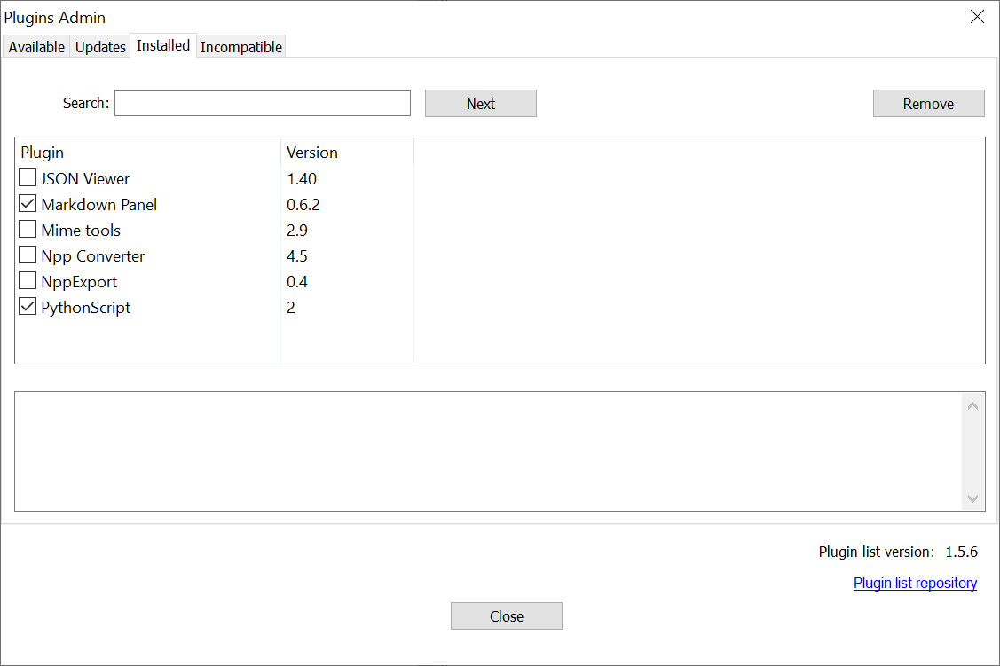
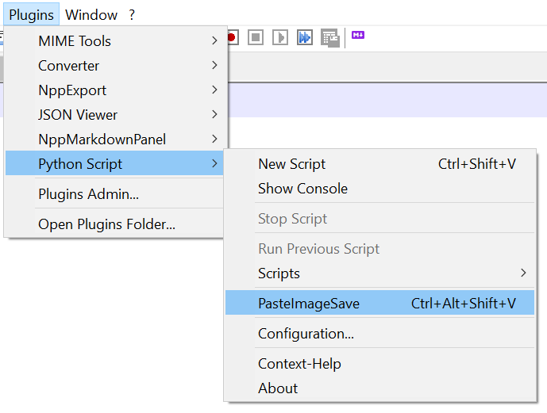
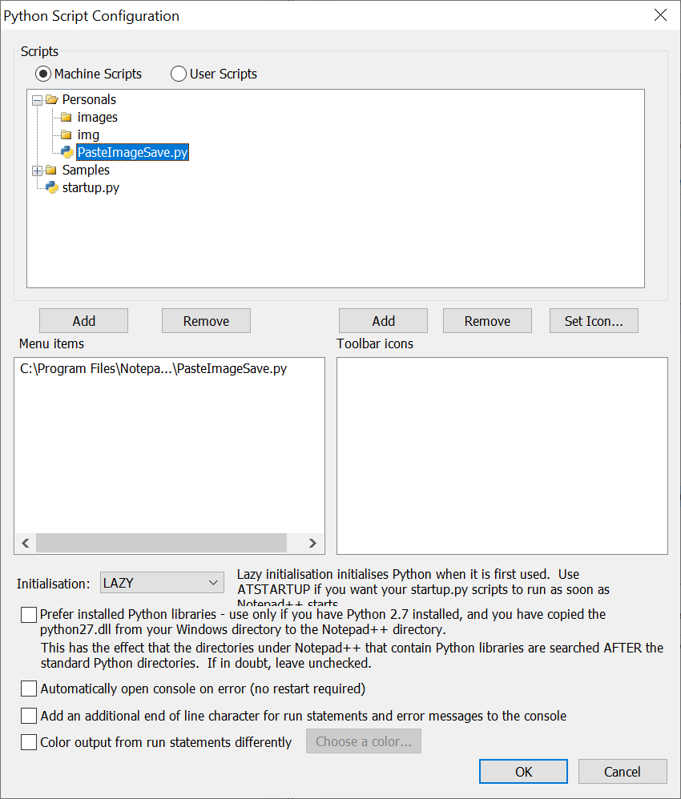
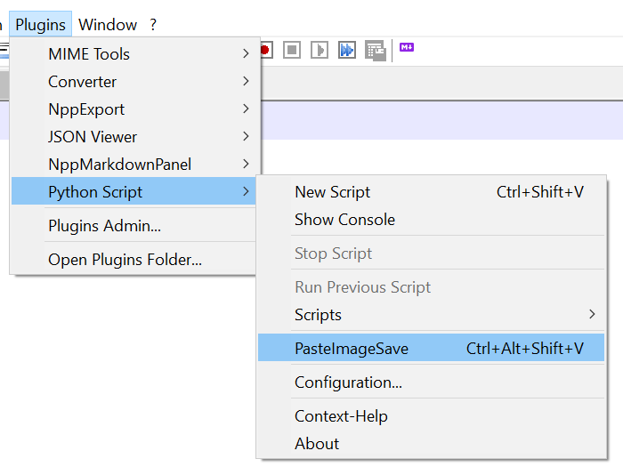
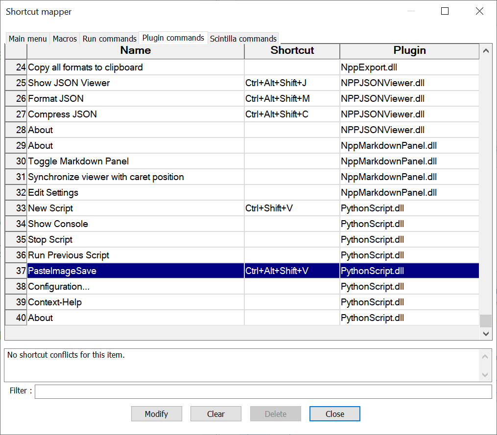
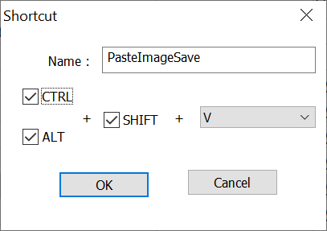

# Notepad++ paste Markdown images: installation details

This guide is tested for:

- Notepad++ v8.4.7.
- Python Script 2 Notepad++ plugin.
- (optional) Markdown Panel 0.6.2 Notepad++ plugin.

Install Notepad++ plugins using **Plugins | Plugins admin...**  menú.



> Please note: Markdown Panel fails to refresh after pasting images, which I won't explore. 
In my simplest workflow I just may close Notepad++ and reopen. 
Normally I'll use Windows split screen with Notepad++ on one side and a browser showing MkDocs with live reload, for a much richer experience.

## Configuring the script in Python Script 2 Notepad++ plugin

After installing Python Script 2 Notepad++ plugin you will configure it and have a menu like this, with the script `PasteImageSave` associated to a shortcut (`Ctrl-Alt-Shift-V`)



### Make the script known to PythonScript

Using **Context help** of the plugin, then navigating to **Plugin Installation and Usage**
will instruc you to put your scripts in a certain `"%PROGRAMFILES%"\Notepad++\plugins\Config\PythonScript\scripts` folder

```
Notepad++            (your main Notepad++ directory, probably under "C:\Program Files")
 +
 |
 +-- plugins
                \
                |
                |-- PythonScript
                |   \
                |   |
                |   |-- PythonScript.dll
                |   |
                |   |-- python27.dll         (maybe not necessary if you have a Python installation already, in which case it's probably in C:\windows )
                |   |
                |   |-- lib
                |   |    \
                |   |    |-- (*.py)   lots of *.py files and subdirectories
                |   |
                |   |-- scripts
                |   |   \
                |   |   |-- (machine-level scripts)
                |   |
                |   |-- doc
                |        \
                |        |-- PythonScript
                |             \
                |             |-- index.html        (optional, if it's not there context-sensitive help will use the web)
                |
                |
                |
                |-- Config     (this config directory can also be in %APPDATA%\Notepad++\plugins\config\)
                        |
                        \-- PythonScript
                                         \
                                         |-- scripts
                                                   \
                                                   |-- (user level scripts go here)
```
Copying the file in `"%PROGRAMFILES%"\Notepad++\plugins\Config\PythonScript\scripts` dis not work for me,
but I must admit I didn't try ` %APPDATA%\Notepad++\plugins\config\PythonScript\scripts` which looks like a more civilized place as it won't require permissions.
Feel free to try and notify me back.

Instead, I brute forced with admin privileges 
to create a `%PROGRAMFILES%"\Notepad++\plugins\PythonScript\scripts\Personals` folder (`Personals` as in my mother tongue). Then saved `PasteImageSave.py` in the folder.

### Display the script in the plugin menu

From menú **Plugins | PythonScript | Configuration...** unfold Personals folder and add it to the list o **Menu items**.



The script will then display in the plugin menu.



### Associate the script with a keyboard shortcut

To associate the script with a keyboard shortcut
go to menu ** Setting | Shortcuts mapper...** then tab **Plugin commands**.



Press **Modify** and define your fav shortcut combo breaker.



## On Python usage

>Disclaimer: I am neither a Python guy confident enough with the language intricacies, neither an specialist of Notepad++ API and plugin mechanism, nor whatever Windows does to expose its clipboards.

The script was developed with help of a certain AI 
which was fed with the successive execution errors 
and  managed to discover that 
the available Python is a vanilla 2.7, 
so luxuries like `PIL`'s `Imagegrab` or `pywin32` were out of reach.

I don't like vibe coding, but must admit that when fed with proper goals, the farting cat (guess the French joke) does quite a good job.

